# Graph Algorithms
## Overview
## Resources
## Questions
1. :star: What is the order of the running time of depth-first search in a connected graph?
1. :star: What is the order of the running time of breadth-first search in a connected graph?
1. :star: Breadth-first search uses a queue to maintain the frontier. What does Dijkstra's algorithm use?
1. :star: When is Dijkstra's algortihm better than breadth-first search for finding shortest paths?
1. :star: What is the order of the running time for the Floyd-Warshall all-pairs shortest-path algorithm?
1. :star: A cut partitions a graph into two disjoint sets of vertices. What does the cut property say about cuts, edges, and minimum spanning trees?
1. :star::star: Give a topologial sort of the graph below.

    
1. :star::star: Draw the minimum spanning tree of the graph below.

    
1. :star::star: Why are negative weight cycles a problem when finding shortest paths?
1. :star::star: Which problem is *not* solved using an algorithm based on depth-first search: topological sorting, minimum spanning tree, or connected components?'
1. :star::star: In modern programming languages like Java and Python, objects are deleted (their memory is reclaimed) when they are no longer reachable variables. This is called garbage collection. Suppose several variables refer to objects and objects can contain multiple references to other objects. Describe an algorithm that can find all of the reachable objects.
    
## Answers
1. )
1. )
1. When the graph is weighted.
1. A priority queue.
1. )
1. The smallest-weight edge crossing the cut must be part of any minimum spanning tree.
1. One answer is 2, 1, 5, 4, 0, 3.
1.
    
1. If a path contains a negative weight cycle, "shortest path" is not well-defined; a shorter path can always be found by making another lap around the cycle.
1. Minimum spanning tree.
1. Perform a depth-first search from each variable.
