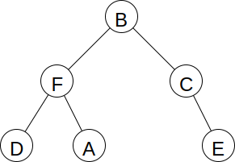

# Traversal
## Overview
### Linear Structures
### Trees
### Graphs
## Resources
## Questions
1. :star: Describe a situation where breadth-first traversal of a graph is preferable to depth-first traversal.
1. :star::star: In what sequence would the nodes of the binary tree below be visited in a postorder traversal?
    
1. :star::star: The methods below, as part of a `Graph` class, are supposed to return an array that is true at those indices corresponding to vertices that can be reached from `start`. As written, the second method goes into an infinite loop for some graphs. Supply the missing code.
    ```java
    public boolean[] reachable(int start) {
        return reachable(start, new boolean[neighbors.length]);
    }

    public boolean[] reachable(int start, boolean[] visited) {
        // Something is missing here
        visited[start] = true;
        for (int n : neighbors[start]) {
            reachable(n, visited);
        }
        return visited;
    }
    ```
1. :star::star: Here is a working method to traverse a linked list. Write a method to traverse the list backward. (Hint: use recursion.)
    ```java
    static void traverse(Node front) {
        for (Node n = front; n != null; n = n.next) {
            System.out.println(n.key);
        }
    }
    ```
## Answers
1. Breadth-first traversal is preferable if you are searching for an item that may appear more than once and you want the one closest to the start vertex.
1. DAFECB
1.
    ```java
    if (visited[start]) {
        return visited;
    }
    ```
1.
    ```java
    static void traverseBackward(Node front) {
        if (front != null) {
            traverseBackward(front.next);
            System.out.println(front.key);
        }
    }
    ```
