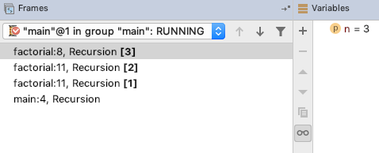

# Recursion
## Overview
A *recursive* method is one that calls itself. This is useful for algorithms that can naturally be expressed in terms of solving a problem by first solving an easier problem.

For example, suppose we want to compute  (pronounced " factorial"), which is the product of the first  positive integers.

Here is a recursive solution:

```java
static int factorial(int n) {
    if (n == 1) {
        return 1;
    }
    return factorial(n - 1) * n;
}
```

The first part, called the *base case*, directly solves a simple problem: .

The second part, the *recursive case*, solves the simpler problem of computing !), then multiplies that result by  to find .

This may seem like a strange way to solve the problem. You should be able to devise a less confusing (and slightly more efficient) algorithm to find the same result using *iteration* (a loop). In fact, anything that can be done with iteration can be done with recursion, and vice versa.

Why, then, should you wrap your head around recursion? Some algorithms are much more naturally expressed using recursion. For example, consider the [Towers of Hanoi](https://www.mathsisfun.com/games/towerofhanoi.html) puzzle, which seeks to move `n` disks from peg `start` to peg `end`, using peg `spare` for temporary storage. A *divide and conquer* algorithm first recursively moves `n - 1` disks to `spare`, then moves the largest disk to `end`, and finally recursively moves `n - 1` disks from `spare` to `end`.

```java
static void hanoi(String start, String spare, String end, int n) {
    if (n == 1) {
        System.out.println(start + " -> " + end);
    } else {
        hanoi(start, end, spare, n - 1);
        System.out.println(start + " -> " + end);
        hanoi(spare, start, end, n - 1);
    }
}
```

Solving this problem using iteration would be considerably more difficult.
## How It Works
Many students scratch their heads when first encountering recursion. Isn't it circular logic to define a method in terms of itself? Won't it go into some kind of infinite loop?

To see your way out of this difficulty, remember [the call stack](https://github.com/PeterDrake/drakepedia/blob/master/control_structures/functional_decomposition.md#the-call-stack). Every time a method is called, the current method is frozen and a new call frame is pushed onto the stack. The only special thing about recursion is that several of these call frames are for the same method. Each one has its own version of any local variables (including arguments) and its own memory of where it was frozen.

As an example, suppose you run this program in IntelliJ's debugger, with a breakpoint at the beginning of `factorial`:

```java
public class Recursion {

    public static void main(String[] args) {
        System.out.println(factorial(5));
    }

    static int factorial(int n) {
        if (n == 1) {
            return 1;
        }
        return factorial(n - 1) * n;
    }

}
```

After a few steps, the call stack looks like this:



The bottom call frame is for `main`, as usual. `main` called `factorial(5)`, which called `factorial(4)`, which called `factorial(3)`, the current call frame.

This doesn't lead to an infinite loop because you eventually hit the base case, which make another recursive call. After it finishes, the top frame is popped off and the frame below picks up where it left off.

For a method with multiple recursive calls, like `hanoi`, the call stack can grow and shrink several times, but the process eventually ends.

If a recursive method doesn't include a base case, or the recursive calls don't get closer to a base case, the call stack *will* grow until the system runs out of memory, at which point the system will crash. This is called a *stack overflow*.

## Thinking Recursively
## Additional Resources
### Online
- Sedgewick and Wayne, *Introduction to Programming in Java* booksite, [Section 2.3](https://introcs.cs.princeton.edu/java/23recursion/)
- CodingBat, [Recursion-1](https://codingbat.com/java/Recursion-1) and [Recursion-2](https://codingbat.com/java/Recursion-2)
### Print
- Sedgewick and Wayne, *Introduction to Programming in Java*, Section 2.3
## Questions
1. :star: What happens if a recursive method with no base case is called?
1. :star: When is recursion preferable to iteration (using loops)?
## Answers
1. It keeps calling itself until the call stack fills up all available memory, at which point the program crashes. This is called a stack overflow.
1. Some algorithms are much more clearly stated using recursion rather than iteration. These are algorithms that solve a problem by first solving one or more easier problems. In general, if you can find a way to express your algorithm iteratively, do that; if, in trying to do this, you find that you need to remember work to do after solving the easier problem, recursion will probably be easier.
