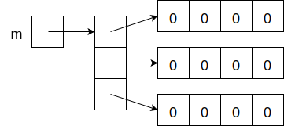

# Arrays
## Declaring and Initializing Arrays
An array holds several elements of the same type. It is declared by adding `[]` after the element type:
```java
int[] arr;
```
To initialize an array, you have to use the keyword `new` and specify how many elements the array contains:
```java
arr = new int[4];
```
While the distinction is irrelevant in *most* situations, it's best to think of the array variable as holding a *reference to* the array:


Note that all of the elements of the array are initialized to default values: 0 for numeric types, `false` for booleans, and `null` for reference types (objects and arrays).

If you have a small array and know the specific values you would like it to contain, you can initialize them directly:
```java
String[] names = new String[] {"Akiko", "Bob", "Carlos", "Danielle"};
```
If the declaration and initialization happen on the same line, as in the example above, you are allowed to omit `new String[]`.
## Indexing
Array elements are numbered *starting at 0*. Thus, `arr[0]` is the first element of `arr`, `arr[1]` is the second, and so on.

You can use this to access or change any element of an array. If we take our array above and set
```java
arr[2] = 8;
```
then the array looks like this:


Java arrays (unlike C arrays) know how long they are. The length of `arr` is `arr.length` (which in this case is 4).

## Multidimensional Arrays
A structure like a matrix or a checkerboard can be represented by a multidimensional array. This is declared using multiple pairs of square brackets:
```java
int[][] m = new int[3][4];
```

A multidimensional array is represented as an array of arrays:



In Java, as in most modern programming languages, the two numbers specify the number of rows and the number of columns, respectively. The lower right box in the diagram above is `m[2][3]`.

## Resources
- Sedgewick and Wayne, *Introduction to Programming in Java*, [Section 1.4](https://introcs.cs.princeton.edu/java/14array/)
- Horstmann, *Core Java, Volume I: Fundamentals, 11th Edition*, Section 3.10
## Questions
1. :star: Can an array have length 0?
1. :star: What is the index of the *last* element of an array `arr`?
1. :star: Given
    ```java
    int[][] m = new int[3][4];
    ```
    what is `m.length`?
1. :star: How would you declare a three-dimensional array of doubles?
1. :star: How many elements are in the array that is the value of the expression `new boolean[2][3][4][5]`?
1. :star: Is there a good way to remember that it's rows, columns and not the other way around?
1. :star: Why does the code below throw a NullPointerException?
    ```java
    String[] words = new String[8];
    for (String w : words) {
        System.out.println(w.length());
    }
    ```
1. :star::star: How can you determine the number of *columns* in a two-dimensional array `m`?
## Answers
1. Yes, any non-negative integer is a valid length.
1. `arr.length - 1`. This is because indices start at 0; if there are 10 elements, they are numbered 0 through 9.
1. 3, which is the number of rows. `length` only follows one reference and counts the number of boxes in the array at the other end.
1. `double[][][] arr;`.
1. 120, which is the product of the dimensions.
1. Think of a can of [RC Cola](https://en.wikipedia.org/wiki/RC_Cola).
1. While `words` itself was initialized, its elements were not. They therefore have the default value `null`.
1. `m[0].length`.
