# Binary Search Trees
## Overview
## Resources
## Questions
1. :star::star: Draw the binary search tree below after deleting 4.
    
1. :star::star: Draw the red-black tree below after inserting 2.
    
## Answers
1. 
1. 
