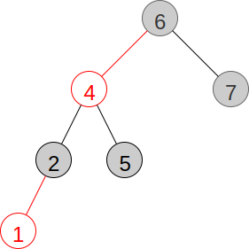

# Binary Search Trees
## Overview
## Resources
## Questions
1. :star: What is the order of the average running time of the search operation on a binary search tree?
1. :star::star: Draw the binary search tree below after deleting 4.

    
1. :star::star: Draw the red-black tree below after inserting 2.

    
1. :star::star: Draw the red-black tree below after inserting 3.

    
## Answers
1. )
1.
    
1.
    
1.
    
