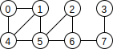
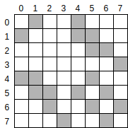
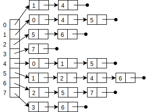

# Graphs
## Terminology
A *graph* consists of a set of *vertices* and a set of *edges*. Each edge connects two vertices.

In the graph below, there are eight vertices, numbered 0 through 7. There is an edge connecting vertices 0 and 1, but no edge connecting 1 and 2.

The *neighbors* of a vertex are the vertices directly connected to it by edges. In the graph above, 4's neighbors are 0, 1, and 5.

Several variations exist, including *directed* graphs (where the edges are one-way arrows) and *weighted* graphs (where there is a number indicating cost or capacity associated with each edge).
## Representation
### Adjacency matrix
An *adjacency matrix* or *neighbor matrix* is a two-dimensional array of booleans, with true at position  if there is an edge connecting vertex  to vertex . The adjacency matrix for the graph above is shown below (with shaded boxes indicating true and unshaded boxes indicating false).

### Adjacency lists
In a graph with  vertices, the amount of memory used by an adjacency matrix is in ). This is fine for graphs that are small or very *dense* (that is, having close to every possible edge), but for typical large, *sparse* graphs, there is a more efficient representation. The *adjacency lists* or *neighbor lists* representation consists of a one-dimensional array, each element of which is a list of the neighbors of the corresponding vertex. The adjacency list representation of the graph above is shown below.

The space taken by this representation is in ), where  is the number of vertices and  is the number of edges.

## Additional Resources
### Online
- Sedgewick and Wayne, *Introduction to Programming in Java* booksite, [Section 4.5](https://introcs.cs.princeton.edu/java/45graph/)
- OpenDSA, [Graphs Chapter Introduction](https://opendsa-server.cs.vt.edu/ODSA/Books/Everything/html/GraphIntro.html) and [Graph Implementations](https://opendsa-server.cs.vt.edu/ODSA/Books/Everything/html/GraphImpl.html)
- Sedgewick and Wayne, *Algorithms* booksite, [Section 4.1](https://algs4.cs.princeton.edu/41graph/)
### Print
- Sedgewick and Wayne, *Introduction to Programming in Java*, 2nd Edition, Section 4.5
- Sedgewick and Wayne, *Algorithms*, 4th Edition, Section 4.1
- Cormen *et al.*, *Introduction to Algorithms*, 3rd Edition, Section 22.1 
## Questions
1. :star: What is the singular form of the plural noun "vertices"?
1. :star: What is the difference between a directed and and undirected graph.
1. :star::star: What is the maximum number of edges in a graph with  vertices? Assume an edge cannot connect a vertex to itself.
## Answers
1. "vertex"
1. In a directed graph, the edges are directional arrows.
1. }{2})

