# Hash Tables
## Overview
## Additional Resources
## Questions
1. :star: What is the order of the average running time of adding something to a hash table?
1. :star: A set can be represented by (among other data structures) a red-black tree and a hash table. Name one advantage of each.
1. :star: In what situation is a hash table preferable to a direct addressing table?
1. :star::star: The hash table below uses linear probing, with the hash function =x\mod10). Insert 618.
    
1. :star::star: A web browser uses a Bloom filter to check URLs against a list of sites known to be dangerous. This involves two tables, one local and one remote. Which one is larger?
## Answers
1. )
1. A hash table is faster: constant time on average for search, insertion, and deletion. A red-black tree allows operations that depend on the ordering of the keys, such as finding the largest key or finding all keys in some specified range.
1. When the universe of possible keys is much larger than the number of actual keys.
1.
    
1. The remote table.
