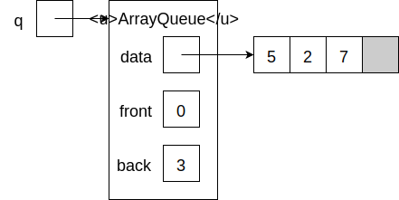
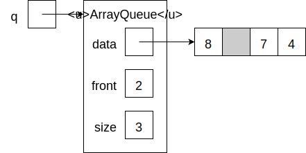

# Queues
## Abstract Data Type
## Array-Based Implementation
## Linked Implementation
## Additional Resources
## Questions
1. :star::star: Here is an array-based queue:

    
    
    Draw the final state of the queue after executing the following sequence of operations:
    ```java
    q.enqueue(4);
    q.dequeue();
    q.dequeue();
    q.enqueue(8);
    ```
## Answers
1.

    
