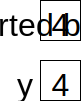
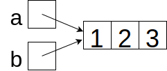
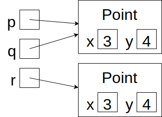

# References
## Overview

Recall that a variable holds *exactly one thing*:


This is a simple story for [primitive types](primitive_types.md).

What if the type is an array type or a class? In this case, the box for the variable contains a *reference* to an object. These types are therefore called *reference types*.

You can think of a reference as an arrow pointing to the object. For example, if you
```java
int[] a = {6, 2, 5};
```
then you have:


The reference points to the entire object, not any particular part of it.
## Assignment and Aliases
The `=` assignment operator copies the contents of one box into another. For primitive types, this is easy to understand. If
you
```java
int x = 4;
int y = x;
```
then the value 4 is copied from `x`'s box into `y`'s:



With references, an assignment still copies the contents of the box, but now that means copying the *reference*, not the object on the other end. For example, if you
```java
int[] a = {1, 2, 3};
int[] b = a;
```
then you get two references to the same array:



`a` and `b` are said to be *aliases* because they refer to the same array. A consequence of this is that, if you modify the array to which `a` refers, you are also modify the array to which `b` refers (because they're the same one).

### Methods Modifying Their Arguments
Methods cannot modify their arguments, but references provide a loophole.

If a method has a primitive parameter, like
```java
static void f(int x) {
    x = 100;
}
```
then doing something like
```java
int y = 7;
f(y);
```
has no effect on `y`. The parameter `x` gets a *copy* of the value stored in `y`, so no matter what happens to `x`, `y` is unchanged.

If, on the other hand, a method has a parameter of an object type, like
```java
static void g(int[] a) {
    a[0] = 3;
}
```
and then you
```java
int[] b = new int[5];
g(b);
```
then the array to which `b` refers *has* been modified, because the parameter `a` is an alias for the argument `b`.

## Equality
References make the notion of equality more complex.

The `==` operator asks whether two boxes contain the same thing: the same primitive value or references to the same object. For example, suppose you have defined a `Point` class
```java
class Point {
    int x;
    int y;
}
```
and then:
```java
Point p = new Point();
p.x = 3;
p.y = 4;
Point q = p;
Point r = new Point();
r.x = 3;
r.y = 4;
```

Memory now looks like this:



then `p == q` but `p != r` because `p` and `r` do not refer to *the same object*.

We are often interested in whether two objects have the same *contents*. In this sense, `p` and `r` are equal. For many built-in classes (including String), the expression `p.equals(q)` is true if `p` and `q` have the same contents. This is the preferred way to compare objects.

You can also write `equals` methods for your own classes.
## Null
The literal value `null` is a reference to nothing. If you
```java
String s = null;
```
then `s` doesn't refer to anything. I draw this as a line connected to a dot rather than to an arrowhead:


Trying to do anything with `s`, such as asking for `s.length()`, results in a `NullPointerException` because there is no String object on the other end.

`null` is the default value for object types.

## Garbage Collection

Every object takes up memory. As soon as an object is unreachable (that is, there are no more references to it), the Java system reclaims that memory through a process called *garbage collection*.

This feature of Java is in contrast to C, where it is the programmer's responsibility to free objects when they are no longer needed. A C programmer who does not manage memory with extreme care can end up with a *memory leak*, where unreachable objects take up more and more memory until the system crashes, or a *dangling pointer*, where a reference points to a location in memory that does not contain the intended object. Either of these bugs can be exceedingly difficult to detect and fix.

## Resources

- Sedgewick and Wayne, *Introduction to Programming in Java*, [Section 3.1](https://introcs.cs.princeton.edu/java/31datatype/)
- Horstmann, *Core Java, Volume I: Fundamentals, 11th Edition*, Section 4.2.1 and 4.3.6
- Draper, [The Worst Mistake of Computer Science](https://www.lucidchart.com/techblog/2015/08/31/the-worst-mistake-of-computer-science/)
## Questions
1. :star: What is the term for two references to the same object?
1. :star: Which types use references?
1. :star: Is it possible to create a dangling pointer in Java?
1. :star::star: Is it possible to create a memory leak in Java?
1. :star::star: If you define `String s = null;`, is `s == null`?
1. :star::star: Suppose you execute the following code (assuming Point is a class with a well-defined `equals` method):
    ```java
    Point a = new Point();
    a.x = 1;
    a.y = 2;
    Point b = new Point();
    b.x = 1;
    b.y = 2;
    Point c = b;
    ```
    1. Is `a == b`?
    1. Is `a.equals(b)`?
    1. Is `b == c`?
    1. Is `b.equals(c)`?
1. :star::star: If you
    ```java
    int[] a = {1, 2, 3};
    int[] b = a;
    a[1] = 5;
    ```
    then what is the value of `b[1]`?
1. :star::star: Suppose you have defined
    ```java
    static void alter1(int[] a) {
        a[0] = 5;
    }
    ```
    and then you:
    ```java
    int[] b = {1, 2, 3, 4};
    alter1(b);
    ```
    What are the elements of `b` afterward?
1. :star::star: Suppose you have defined
    ```java
    static void alter2(int[] a) {
        a = new int[] {5, 6, 7, 8};
    }
    ```
    and then you:
    ```java
    int[] b = {1, 2, 3, 4};
    alter2(b);
    ```
    What are the elements of `b` afterward?
1. :star::star::star: What's the difference between a reference and a pointer?
1. :star::star::star: How can you tell if two arrays `a` and `b` have the same contents?
1. :star::star::star: What type is the literal value `null`?
## Answers
1. Aliases.
1. All non-primitive types, that is, array types and types defined by classes and interfaces.
1. No. The only way to get a reference is to create a new object using new `new` (or special syntax for arrays and Strings). The only way to get rid of an object is to set the last reference to it to refer to `null` or another object.
1. Not strictly speaking; you can't have an object that is truly unreachable. If, however, you stored extra references to objects in an array and then changed the original references, the objects would still be reachable and they would therefore not be garbage collected.
1. Yes. `==` compares the contents of the box for `s` to the literal value `null` and determines that they're the same. It doesn't cause a NullPointerException because this check doesn't look at what's on the other end of the reference.
1.
    1. No (`a` and `b` refer to different objects)
    1. Yes
    1. Yes (`b` and `c` refer to the same object)
    1. Yes
1. 5, because `a` and `b` are aliases. There is only one array, which can be accessed via either reference.
1. 5, 2, 3, 4. Since `a` and `b` refer to the same array, alterations to the array on the other end of the reference are visible from either variable.
1. 1, 2, 3, 4. Making the local variable `a` point to a new array does not affect the external variable `b`.
1. Some sources will use these two words interchangeably. Indeed, a pointer (which is the address of a location in memory) is one way for a compiler to implement a reference. Other sources will insist that it's only a pointer if you have access to the address and can perform arithmetic on it to, for example, find the next consecutive location in memory. This is what people mean when they say, "C has pointers but Java does not." The designers of Java felt that the few additional shortcuts you can take with "true" pointers aren't worth the subtle and frustrating bugs that can result from messing with addresses directly.
1. `a == b` only checks if the two references are to the same array and `a.equals(b)` is not defined for arrays. One solution is to iterate through the elements using a (possibly nested) [loop](../control_structures/loops.md). Another is to use `java.util.Arrays.equals(a, b)` (for one-dimensional arrays) or `java.util.Arrays.deepEquals(a, b)` (for multidimensional arrays).
1. `null` has its own type, which has no name. It can be cast to any other object type. While many programming languages have such a special value, some computer scientists consider it [a bad idea](https://www.lucidchart.com/techblog/2015/08/31/the-worst-mistake-of-computer-science/).
