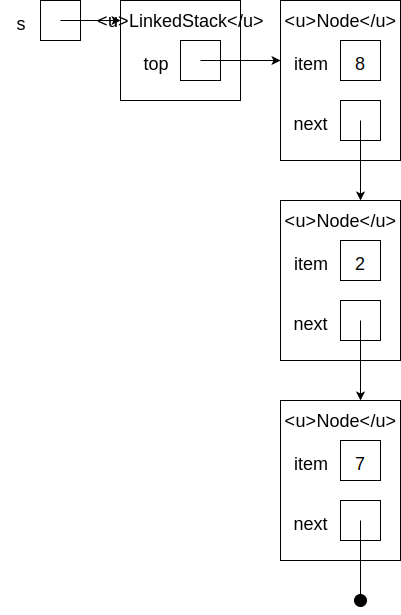

# Stacks

## Abstract Data Type

An *abstract data type* defines a data type and the associated operations. It does not say anything about how these operations are implemented; it merely conveys the idea of the data type.

The *stack* abstract data type defines a stack as a sequence of items, with the following operations:

-`push` adds an item to the top of the stack
-`pop` removes and returns the top item from the stack
-`isEmpty` returns true if the stack is empty

The standard metaphor for a stack is one of those spring-loaded stacks of plates you might find in a cafeteria. You can push a new plate onto the stack or pop one off the top, but there's no way to access the plates underneath. Stacks are said to be *last in, first out* (LIFO).

The sequence of previously-viewed pages that your web browser maintains to allow you to go back is represented as a stack.

in Java, an abstract data type is represented by an [interface](../oop/interfaces.md). The Stack interface looks like this:

```java
public interface Stack<T> {

    public boolean isEmpty();

    public T pop();

    public void push(T item);
    
}

```

There are multiple ways to implement this interface, described below.

## Array-Based Implementation
The items in the stack can be kept in an array. The only catch is that an array has a fixed size, while a stack can grow and shrink as items are pushed and popped. Two simple tricks deal with this problem:

- Maintain an int `size` indicating how many items are currently in the stack. Thus, even if the array has room for 8 items, if `size` is 5, only the first 5 items are considered part of the stack.
- If anyone tries to push onto a full stack, copy all of the current items into a new, larger array first.

Here is code for the array-based implementation:

```java
public class ArrayStack<T> implements Stack<T> {

    private T[] data;

    private int size;

    public ArrayStack() {
        data = (T[]) new Object[1];
    }

    @Override
    public boolean isEmpty() {
        return size == 0;
    }

    @Override
    public T pop() {
        size--;
        return data[size];
    }

    @Override
    public void push(T item) {
        if (size == data.length) { // Array is full; resize
            T[] d = (T[]) new Object[data.length * 2];
            for (int i = 0; i < size; i++) {
                d[i] = data[i];
            }
            data = d;
        }
        data[size] = item;
        size++;
    }

}

```

Clearly the `isEmpty` and `pop` operations take constant time.

`push` takes constant time in the best case, but in the worst case (when the array was full) it takes linear time to copy all of the items currently in the stack into the larger array. It turns out that `push` takes constant [amortized time](../algorithms/analysis.md#best-case-average-worst-case-and-amortized-analysis) if, as in the code above, the array capacity is *doubled* every time it is expanded. Then, when pushing *n* items in a row (which is the worst case), the total amount of copying is

1 + 2 + 4 + 8 + ... + *n* < 2*n*

or less than 2 copies (constant) per item.

## Linked Implementation

A linked implementation uses a chain of linked list nodes. The LinkedStack object knows about the top node, which knows about the next node, and so on. Here is the code:

```java
public class LinkedStack<T> implements Stack<T> {

    private class Node {

        T item;

        Node next;

        Node(T item, Node next) {
            this.item = item;
            this.next = next;
        }

    }

    private Node top;

    @Override
    public boolean isEmpty() {
        return top == null;
    }

    @Override
    public T pop() {
        T result = top.item;
        top = top.next;
        return result;
    }

    @Override
    public void push(T item) {
        top = new Node(item, top);
    }

}
```

All three stack methods take constant time.

## Additional Resources

- Sedgewick and Wayne, *Introduction to Programming in Java*, [Section 4.3](https://introcs.cs.princeton.edu/java/43stack/)
- Cormen *et al.*, *Introduction to Algorithms, 3rd Edition*, Section 10.1

## Questions
1. :star: In the array-based implementation, does `size` indicate the index of the current top item or the index of the next item to be pushed?
1. :star::star: Here is a linked stack:

    
    
    Draw the final state of the stack after executing the following sequence of operations:
    ```java
    s.push(4);
    s.pop();
    s.pop();
    s.push(8);
    ```
1. It would save space to replace the epxression `data.length * 2` in the `push` method of ArrayBasedStack with `data.length + 1`. What effect would this have on the amortized running time of `push`?
## Answers
1. The next item to be pushed. The current top item, if there is one, is at index `size - 1`.
1.
    
1. The total amount of copying in pushing *n* items would become

    1 + 2 + 3 + ... + *n* = *n*(*n* + 1) / 2
    
    which is (*n* + 1) / 2 copies per item. The amortized time is therefore linear.
