# Union-Find
## Overview
## Resources
## Questions
1. :star: When using a forest of trees to represent disjoint sets, what tree shape is more efficient: tall and narrow, or short and wide?
1. :star::star: The array below represents the forest of trees used by the quick-union data structure for disjoint sets. Draw the array after merging the sets containing 0 and 5. Merge the smaller tree into the larger, but don’t worry about path compression.

    
## Answers
1. Short and wide.
1.
    
