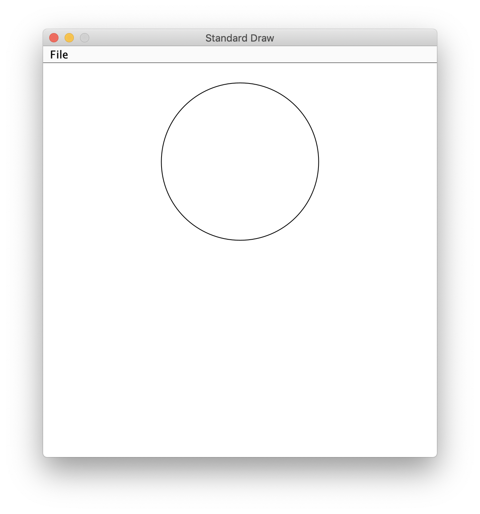

# stdlib
## Overview
The Princeton Standard Library, also known as stdlib, is a collection of Java classes developed by Robert Sedgewick and Kevin Wayne to make certain tasks easier. Installation is [straightforward](../development_tools/intellij_idea.md#installing-stdlib).
## Writing to the Console
The standard Java

```java
System.out.println("Hello!");
```

is replaced with the slightly more concise:

```java
StdOut.println("Hello!");
```

## Reading From the Console

To read a line of text from the console and store it in a String `s`:

```java
String s = StdIn.readLine();
```

If you search for the standard Java way of doing this, you'll probably find an overly complicated procedure involving a Scanner object.

You can ask for particular types of data:

```java
int n = StdIn.readInt();
```

Two things to watch out for:

- When your program gets to any sort of read, it will stop until the user enters appropriate input. To avoid confusing your user, print some sort of prompt first.
- If you use something like `readInt`, only the next available number (and any whitespace before it) is consumed. The rest of the line remains in the input stream waiting to be read. Thus, if the user types `23` on a line by itself, a call to `readInt` will return 23 and a subsequent call to `readLine` will return an empty String (the rest of the line). You can avoid this by either (a) not mixing the two or (b) calling `readLine` to flush out the rest of the line after reading a number.

## Interacting With Files

If you define

```java
Out out = new Out("junk.txt");
```

and then

```java
out.println("Hello!");
```

then `Hello!` will be written to the file `junk.txt`. Each time you run your program it will replace the old contents of the file.

Similarly, if you define

```java
In in = new In("junk.txt");
```

then each

```java
String s = in.readLine();
```

will read another line of text from the file. You'll often want to do this in a [loop](../control_structures/loops.md), using `in.isEmpty()` to detect when you've reached the end of the file.
## Random Numbers
You can generate a random double that is at least 0.0 and less than 1.0 with:

```java
double x = StdRandom.uniform();
```

To generate a random integer that is at least 0 and less than 10:

```java
int n = StdRandom.uniform(10);
```

## Graphics
While it would not be a good choice for building a complicated user interface will all kinds of buttons, sliders, and text fields, stdlib is *much* easier to use than the standard javax.swing for creating simple diagrams, animations, and games.

A [wide variety](https://introcs.cs.princeton.edu/java/stdlib/javadoc/StdDraw.html) of methods are available in the StdDraw class. For example,

```java
StdDraw.circle(0.5, 0.75, 0.2);
```

creates this picture:


The three arguments in the case are the *x* coordinate, the *y* coordinate, and the radius.

*x* ranges from 0.0 on the left to 1.0 on the right; *y* ranges from 0.0 at the bottom to 1.0 at the top. This is what you're probably used to from plotting curves in mathematics, but differs from some other computer graphics systems (which measure *y* from the top down).

### Double Buffering

StdDraw has two modes. The default mode, designed to let people get started as quickly as possible, draws things on the screen as soon as commands are executed.

The other mode stores up the various draw commands and doesn't show anything until there is a call to `StdDraw.show()`. This is called *double buffering*. If you are drawing many things or doing any sort of animation, this will avoid an ugly flickering effect. To enter this mode,

```java
StdDraw.enableDoubleBuffering();
```
once at the beginning of your program.
### Animation
If you are doing animation in a loop, resist the temptation to just change one part of the screen; that way lies confusion and despair. Instead, start each pass through your loop with
```java
StdDraw.clear();
```
to clear the window, redraw *everything*, and end each pass with
```java
StdDraw.show();
```

The method `StdDraw.pause`, which takes a number of milliseconds as an argument, is vital for adjusting the speed of your animation.

### Mouse and Keyboard Input
The methods for detecting mouse and keyboard events are, perhaps surprisingly, in the StdDraw class. It is best not to combine these with methods from StdIn, as that would require the user to click back and forth between two windows.

To detect a mouse click:

```java
while (!StdDraw.isMousePressed()) {
    // Wait for mouse to be pressed
}
double x = StdDraw.mouseX();
double y = StdDraw.mouseY();
while (StdDraw.isMousePressed()) {
    // Wait for mouse to be released
}
```

Now `x` and `y` hold the coordinates of the location where the mouse was clicked.

There are two different ways to detect keyboard input. If you want to detect discrete key presses, use:

```java
while (!StdDraw.hasNextKeyTyped()) {
    // Wait for keypress
}
char c = StdDraw.nextKeyTyped();
```

If, on the other hand, you want to detect whether a specific key is down right now (as you might in a real-time game), start your program (even before the word `class`) with

```java
import static java.awt.event.KeyEvent.*;
```

and then use:

```java
if (StdDraw.isKeyPressed(VK_A)) {
    ...
}
```

In this case, `VK_A` is the special code for the 'a' key. There are [similar codes](https://docs.oracle.com/en/java/javase/11/docs/api/java.desktop/java/awt/event/KeyEvent.html) for all of the other keys, like `VK_SHIFT`.

## Resources
- [stdlib documentation](https://introcs.cs.princeton.edu/java/stdlib/)

## Questions
1. :star::star: Why aren't we using real Java?
1. :star::star: How would you generate the result of rolling a fair, six-sided die?
1. :star::star: Why doesn't the code below draw anything?
    ```java
    StdDraw.enableDoubleBuffering();
    StdDraw.filledRectangle(0.5, 0.5, 0.1, 0.3);
    ```
1. :star::star::star: Write a program that draw a dot and moves it left or right a little each time the user presses and releases 'a' or 'd', respectively.
1. :star::star::star: Write a program that draw a dot and moves it continuously left or right whenever 'a' or 'd', respectively, is being held down.
## Answers
1. This is real Java; nothing about the language has changed. We are simply using a library that someone else has written so that we don't have to write a bunch of tedious code that isn't relevant to the topics we're studying.
1.
    ```java
    int roll = StdRandom.uniform(6) + 1;
    ```
    or
    ```java
    int roll = StdRandom.uniform(1, 7);
    ```
1. It must be followed by `StdDraw.show();`.
1.
    ```java
    public class TurnBased {

        public static void main(String[] args) {
            StdDraw.enableDoubleBuffering();
            double x = 0.5;
            while (true) {
                StdDraw.clear();
                StdDraw.filledCircle(x, 0.5, 0.1);
                StdDraw.show();
                while (!StdDraw.hasNextKeyTyped()) {
                    // Wait for keypress
                }
                char c = StdDraw.nextKeyTyped();
                if (c == 'a') {
                    x -= 0.1;
                } else if (c == 'd') {
                    x += 0.1;
                }
            }
        }

    }
    ```
1.
    ```java
    import static java.awt.event.KeyEvent.*;

    public class RealTime {

        public static void main(String[] args) {
            StdDraw.enableDoubleBuffering();
            double x = 0.5;
            while (true) {
                StdDraw.clear();
                StdDraw.filledCircle(x, 0.5, 0.1);
                StdDraw.show();
                if (StdDraw.isKeyPressed(VK_A)) {
                    x -= 0.001;
                } else if (StdDraw.isKeyPressed(VK_D)) {
                    x += 0.001;
                }
            }
        }

    }
    ```
